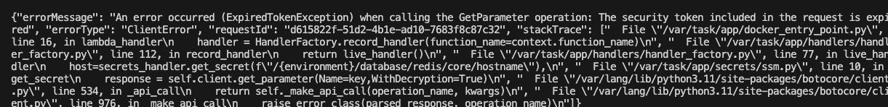

# Docker Dev Containers for Lambda Development
## Introduction
Repo for code development for Lambda Functions.

The service/template/ Function recieves messages from SNS as a subscriber service. 


## Prerequisites
The following software needs to be installed:

- WSL2 -  if using windows (Host)
- AWS SAM installed on your HOST machine ** DO NOT TRY TO RUN SAM FROM THE DEV CONTAINER **
- Docker Desktop(License required) or Docker Engine (CE) 
- gimme-aws-credentials installed on the host * INSIDE WSL if Windows.** If you have OKTA
    - An OKTA Config for gimme-aws-creds that can connect to your AWS Account using the an appropriate Role

Alternative is to provide AWS Credentials as parameters in the dev container once it has startred.


## References

|Term | Description |
|--|--|
|Host| Your laptop, computer that is running the Docker software|
|Dev Container| The process that is started in VS Code

## Developing Locally 
Use VSCode Dev Container with Docker. 
1. Pull this repository to your local machine
2. Open the folder in VSCode
3. Press ctrl+p (windows) / cmd + p (mac)
4. enter: 
```> dev containers: Rebuild Container``` in the command pallette
5. Let the Docker Container Start


## Running Lambda Apps Locally on the HOST machine
You can run the Lambda on your host machine whilst coding live changes inside your VSCode Dev Cotnainer. Using your WSL console, or Terminal in Linux FROM YOUR HOST.

To start the SAM Lambda Simulator from your HOST:
- Open a terminal (WSL if Windows) on your HOST machine 
- CD to the service directory where both apps are stored in this code project. 

For example my git path is:
```
~/Dev/github/aws_docker_container
```
cd to:

```
~/Dev/github/aws_docker_container/service
```

### Using OKTA to authenticate SAM
```
export AWS_PROFILE={WHATEVER YOU CALLED YOU PROFILE ON GIMME-AWS_CREDS*} \
gimme-aws-creds --profile $AWS_PROFILE && docker build ./template -t template:latest && sam local start-lambda --invoke-image template:latest --skip-pull-image --host 0.0.0.0 --profile $AWS_PROFILE
```
> *Change {WHATEVER YOU CALLED YOU PROFILE ON GIMME-AWS_CREDS} in the example code above to a gimme-aws-creds profile name.  

In order to get the appropriate role on your host machine, you can list all of your available role names by running the following command

```
gimme-aws-creds --list-profiles | grep -i '\[.*\]'
```

Your lambda code should now be running on your local machine, and will be able to access services in AWS. The Lambda shares your gimme-aws-creds profile that you provided. 

**NOTE**: Since you are using temporary AWS Credentials, you will likely find after having been coding for a long time that your gimme-aws-creds have expired and the app is reporting access denied  errors. If this happens close the running Lambda in your HOST console and restart the app.



### USING AWS IAM Credentials
You can create a profile in ~/.aws/credentials with and store your IAM Credentials. Creating IAM Credentials is out of scope of this readme. 

```
export AWS_PROFILE={WHATEVER YOU CALLED YOU PROFILE ON GIMME-AWS_CREDS*} \
&& docker build --platform linux/amd64 ./example_function -t example_function:latest && sam local start-lambda --invoke-image example_function:latest --skip-pull-image --host 0.0.0.0 --profile $AWS_PROFILE
```

#### Testing the template code
```
curl -H "Content-Type: application/json" -XPOST http://host.docker.internal:3001/2015-03-31/functions/template/invocations -d "@$REMOTE_HOME/service/test_events/sns.json"
```


You will know if VSCode is running in a dev container as it shows this in the bottom right toolbar highlighted in blue:


**NOTE**: You can also use Postman, if you prefer, by taking the content of the test_event/sns.json file and posting it into the body of the Postman call. With the Lambda App already running on you Local machine - set your type to _POST_ and the URL as:

> http://localhost:3001/2015-03-31/functions/template/invocations


## Helpful tips

## Known Issues - With Resolutions

### Ocassionally VSCode will complain that it can't find "module named", even although it is correctly configured.

Resolution:
1. Press CTRL+P (Windows) / CMD+P (Mac)
2. Type ``` >Pylint: Restart Server```

3. Click on the option from the command palette to restart Pylint.